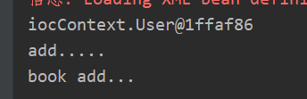

> 本篇文章主要介绍是IOC和DI，介绍其注解的方式实现，并设置一个例子进行说明

## 一、Spring基础知识IOC和AOP

### IOC（控制反转）
中文名叫做控制反转，主要就是实现动态代理这个的东西，为的就是将创建对象交给spring，然后使用工厂的模式和动态代理的方式进行创建对象。

总共有两种方式进行实现，**配置方式**和**注解方式** （主要的使用方式）

在进行ioc的时候，免不得出现需要属性注入的操作，也就是怎么讲变量的值或者是一个对象传递过去，这种操作较**DI**也即是依赖注入。 主要也就是对象的注入，因为这样的话就是可以实现两个对象之间的耦合，实现数据的传输。

#### IOC和DI的区别

- IOC：控制反转，把对象创建交给spring进行配置
- DI：依赖注入，向对象里面的属性进行设置值
- 关系：依赖注入不能够单独的存在，需要在ioc的基础上完成操作。

### AOP（面向切面）
主要的作用是为了实现（目前的认知）：就是记录某个方法的运行状态，或者是增强某个方法。但是这个的方式现在还是不是很熟悉。  

aop常用的是在数据库编程中，也就是事务的编写，主要解决的问题就是当一个请求需要多个部门进行审核的时候，请求在某个部分不被通过，那么就直接被驳回？ 但是这个aop又有什么关系？


## 二、IOC的实现方式

### 使用配置的方式进行注入

```xml
<!-- ioc 入门配置-->
<!-- 其中id就是新建的用户名， class 就是类的绝对路径 scope="prototype" 这个表示新建的实例是多实例，不加的话默认是单实例，即每次调用的都是同一个对象-->
<bean id = "book" class="ioc.Book"></bean>
<!--测试注入的方法  都必须定义属性然后设置set方法。-->
<bean id="user" class="ioc.User">
    <!--1 进行属性的注入 -->
    <property name="userName" value="小红" ></property>
    <!--2 进行对象的注入 -->
    <property name="book" ref="book"></property>
</bean>
```

首先bean标签表示新建一个对象， property标签表示调用的set方法进行的属性的注入。这种方式就是表示，所有的类都是可以通过这种方式进行进行对象的创建。包括jar包中的类。

### 常用的注解

#### 在类上使用的注解，表示这个类由spring进行构建

- `@Component`  最基础的
- `@Controller`  WEB层
- `@Service` 业务层
- `@Repository` 持久层

以上四个注解都是表示将类交给spring进行 处理，虽然名称不一致，但是作用是一致的，不同的名字表示这个对象是用在哪一个层，是的对象更好的分类

####  进行注入的注解

- `@Autowired` 表示自动的注入


### 例子测试

以下为注解的方式进行测试spring代码。测试平台为idea，新建spring项目即可。

总共有四个文件 user.java  book.java  bean.xml  test.java，其中user对象中进行注入book对象。

```java
User.java
@Component(value = "user")
public class User {

    //自动注入 只需要将对象创建好就行。
    @Autowired
    public Book book;

    public void add(){
        System.out.println("add.....");
        book.add();
    }
}

Book.java
@Component("book")
public class Book {
    public void  add(){
        System.out.println("book add...");
    }
}
```

```xml
这个主要需要注意的就是依赖的引用。即bean依赖和context依赖。
<?xml version="1.0" encoding="UTF-8"?>
<!--schema 约束-->
<beans xmlns="http://www.springframework.org/schema/beans"
       xmlns:xsi="http://www.w3.org/2001/XMLSchema-instance"
       xmlns:context="http://www.springframework.org/schema/context"
       xsi:schemaLocation="
       http://www.springframework.org/schema/beans
       http://www.springframework.org/schema/beans/spring-beans.xsd

       http://www.springframework.org/schema/context      
       http://www.springframework.org/schema/context/spring-context.xsd ">

    <!-- ioc 入门配置-->
    <!--实现注释的方式进行spring配置-->
    <!--开启扫描 base 表示扫描iocContext 包-->
    <context:component-scan base-package="iocContext"></context:component-scan>

</beans>
```

最后是测试Test.java的。需要做的主要有加载xml文件获取spring构建的对象。

```java
package iocContext;

import org.junit.Test;
import org.springframework.context.ApplicationContext;
import org.springframework.context.support.ClassPathXmlApplicationContext;

/**
 * @author Seven
 * @description 进行测试用户的案例
 * @create 2019-10-13 19:04
 **/

public class TestContext {
    @Test
    public void Test(){

        // 1 加载spring配置文件，根据其创建对象
        ApplicationContext context = new ClassPathXmlApplicationContext("beanContext.xml");

        // 2 得到配置创建的对象
        User user = (User) context.getBean("user");

        // 3 调用spring 自动生成的对象，然后进行调用。
        System.out.println(user);
        user.add();
 
    }
}
```

最后可以很好的输出结果。




