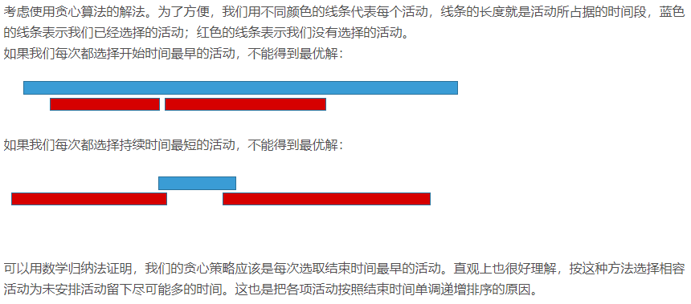

> 本篇主要是研一算法期末考试整理出来的期末考试资料，不过其中的算法对于剑指offer还具有一定的参考价值


### 常用算法思想解析

主要有 动态规划，背包问题。贪心算法。还有就是回溯法，快速排序。分支界限法。

### 不同算法类型的定义

- 每个阶段只有一有个状态->**递推**；

- 每个阶段的最优状态都是有上一个阶段的最优状态得到的->**贪心**；

- 每个阶段的最优状态都是由之前所有阶段的状态的组合得到的->**搜索**；

- 每个阶段的最优状态可以从之前某个阶段或某些状态直接的得到而不管之前这个状态是如何得到的->**动态规划**。  

  

每个阶段的最优状态可以从之前某个阶段的某个或某些状态直接得到，这个性质叫做**最优子结构**。

  

动态规划就涉及到一个问题。 到了第i个位置， 选或者不选？ 所以说只需要记录前一个状态就行。

但是贪心的话就是，不管是到了哪个位置，我都是要找到最优的选择，也就是说，局部的最优最终会形成最后的最优序列。

#### 快排

其中在进行分治的时候，需要有一个等号，不然的话有相同数据的时候会出现死锁的情况。

填坑法。 [参考链接](https://segmentfault.com/a/1190000004410119)

```c
#include "stdio.h"

//快速排序占坑法。
int Partation(int A[],int left,int right)
{
    int tempNum = A[left]; //记录第一个数据的位置，因为要占用这个进行数据交换。
    while(left < right)
    {
        while(A[right] >= tempNum && left < right) //要有一个等号，不然的话相同的数据不知道往哪放。
            right--;
        A[left] = A[right];
        while(A[left] < tempNum && left < right)
            left++;
        A[right] = A[left];
    }
    A[left] = tempNum; 最后将分割点进行归位。
    return left;
}

int QuickSort(int A[],int left,int right)
{
    int mid = 0;
    if(left >=  right)
        return 0;
    mid = Partation(A,left,right);
    QuickSort(A,left,mid-1);  //此时确定了第一个位置。
    QuickSort(A,mid+1,right);
}
int main()
{
    int A[11] = {6, 1, 2, 5, 4, 3, 9, 7, 10, 8,1};
    int i = 0;
    QuickSort(A,0,10);
    for(i=0;i<11;i++)
    {
        printf("%d ",A[i]);
    }
}
```

### 一 第一章 

#### 统计数字问题 p8 1-1

现在是运用的是暴力求解

```c
#include<iostream>
using namespace std;

void count_num(int n)
{
    int count[10]={0};   //赋值初始化，10个值也即是有十个
    for (int i=0;i<=n;i++)
    {
        int t=i;
        if(0==t)
        {
            count[0]++;//计算第一个0的个数
        }

        while(t)
        {
            count[t%10]++;//计算高位出现次数相当于暴力求解..
            t/=10;//依次向低位
        }
    }
    for(int i=0;i<10;i++)
        printf("present num of %d is %d\n",i,count[i]);
}

int main()
{
    count_num(34567);
    return 0;
}
```

#### 字典序问题  p8 1-2 

考察一般情况下长度不超过 $k$的升序字符串，假设以第$i$个字符打头的长度不超过k的升序字符串个数为$f(i,k)$，长度不超过k的升序字符串总个数为$g(k)$，则$g(k) = \sum^{26}_{i=1}{f(i,k)}$。易知：  

$$ f(1,i) = 1  \qquad    \qquad \qquad  \qquad \qquad   \qquad g(1) = \sum^{26}_{i=1}f(i,1) = 26$$  
$$f(i,2) = \sum^{26}_{i=i+1}f(j,1) = 26-i   \quad \qquad  g(2) = \sum^{26}_{i=1}f(i,2) = \sum^{26}_{i=1}(26-i)=325$$

一般情况下：  
$$f(i,k) = \sum^{26}_{i=i+1}f(j,k-1)  \qquad g(k) = \sum^{26}_{i=1}f(i,k) = \sum^{26}_{i=1}\sum^{26}_{j=i+1}(j,k-1)$$​

据此可以计算出每个升序字符串的编码  

```c
#include "stdio.h"
#include "string.h"

// 总的来说就是，比如说对于一个string 长度为k=4 那么k=3 k=2 k=1 的数量是一定的，可以直接的计算出来，之后在进行累加就行，
// 之后在进行计算超出来的那些多余的部分。
int f(int i, int k) //f函数 第i个字符大头的长度不超过k的升序字符串个数为f(i,k);
{
    int sum = 0;
    if(k==1)
        return 1;
    else
    {
        int j;
        for(j=i+1; j<=26; j++)
            sum += f(j, k-1);
    }
    return sum;
}

int g(int k)  //g函数 长度不超过k的升序字符串总个数为g(k)
{
    int i;
    int sum = 0;
    for(i=1; i<=26; i++) //26个字母进行循环
        sum += f(i, k);
    return sum;
}

int change(char c)  //字符串转成数字
{
    return c - 'a' + 1;
}

int order(char s[])
{
    int len = strlen(s);
    int i;
    int sum = 0;
    int temp = 0;
     //获取1--len-1长度的子字符串数
    for(i=1; i<len; i++)
        sum += g(i);
     //小于第一个字母的长度为len的所有组合个数
    for(i=1; i<change(s[0]); i++)
        sum += f(i, len);
    //以第一个字母作为开始的字符串组合个数
    for(i=1,temp=change(s[0]); i<len; i++)
    {
        int t = change(s[i]);  //获取此时的字母并转换为数字
        int len1 = len - i;    //获取此时的长度
        int j;
        for(j=temp+1; j<t; j++)  //获取比此时数字小，长度是此时的长度的所有组合的个数
            sum += f(j, len1);
        temp = t;   //获取当前字符值，方便下一次从此项+1开始累加
    }
    return sum+1;
}

int main()
{
    char s[7];
    printf("输入一个字符串：");
    while(scanf("%s", s)!=EOF)
    {
        int n = order(s);
        printf("该字符串的字典序为：%d\n", n);
        printf("输入一个字符串：");
    }
    return 0;
}
```

#### 最大间隙问题 p10 1-5

[参考链接](https://blog.csdn.net/ldutyk/article/details/52475432)

暴力求解 但是不满足线性时间。

```c
#include<stdio.h>
#include<iostream>
#include<algorithm>
using namespace std;
double a[10000002];
int main()
{
    int t;
    double x=0.0;
    double max=0.0;
    
    scanf("%d",&t);
    for(int i=0;i<t;i++){
        scanf("%lf",&a[i]);
    }
    sort(a,a+t);
    for(int i=0;i<t-1;i++){
            x=a[i+1]-a[i];
            if(x>max){
                max=x;
            }
    }
    printf("%.1lf\n",max);
    return 0;
}
```

[线性时间算法](http://www.voidcn.com/article/p-nnmchbkc-rp.html)  

算法思想：

该问题最先想到可能就是排序后计算，但排序的时间复杂度最少为O(nlongn)，不能满足题意的线性时间算法。所以有一个解决该问题的算法，筒排序。

该算法的思想为，将n个数的最大值、最小值找到，在[ min ,max ]区间内，分成n-1个等大的区间，每个区间的大小为 len = （max - min）/（n-1），然后将n个数字填入到这n-1个

区间中，并根据填入的数，找到该区间内数字的最大值与最小值。除去两边的最大值和最小值，只需要将n-2 个数字填入到 n-1个区间中，根据抽屉原理，那至少有一个空的区间，所以，最大间隙一定产生在两个不同区间之间。

 

```c
#include <stdio.h>
#define INF 1<<30
struct node{
    double left,right;
    double max=-INF,min=INF;
    int index=0;
}x[105];

int main()
{
    int i,j;
    int n;
    double ans[105],max=-INF,min=INF;
    scanf("%d",&n);
    for(i=0;i<n;i++)//在输入的时候找到最大值和最小值，作为桶的边界
    {
        scanf("%lf",ans+i);
        if(max<ans[i])
            max=ans[i];
        if(min>ans[i])
            min=ans[i];
    }
    
    double len = (max-min)/(n-1); //计算等区分的大小

    x[0].left=min;
    x[0].right=min+len;
    
    for(i=1;i<n-1;i++)
    {
        x[i].left = x[i-1].right;
        x[i].right = x[i].left + len;
    }
    for(i=0;i<n;i++)
    {
        int temp = (ans[i]-min)/len;
        if(temp>=n-1)
            temp=n-2;
        x[temp].index++;
        if(ans[i] > x[temp].max)
            x[temp].max=ans[i];
        if(ans[i] < x[temp].min)
            x[temp].min = ans[i];
    }
    double Max = -INF;
    for(i=1;i<n-1;i++)
    {
        if(x[i].min==INF)
            x[i].min = x[i-1].max;
        if(Max<x[i].min - x[i-1].max)
            Max = x[i].min - x[i-1].max;
        if(x[i].max==-INF)
            x[i].max=x[i].min;
    }
    printf("%lf\n",Max);
    return 0;
}
```

### 第二章：

#### p38 2-3 改写二分搜索算法。

[参考链接](https://blog.csdn.net/bensonrachel/article/details/78116181)

```c
#include<iostream>
using  namespace std;

int BIN(int a[], int key, int n) {
    int left = 0;
    int right = n - 1;

    int i = 0;
    int j = 0;
    //也就是一个partation分治的算法，意思就是找到最后没有找到时，也就是跳出while循环，输出i j就可以。
    while (left <= right) {
        int middle = (left + right) / 2;

        if (key == a[middle])
        {
            i = j = middle;
            cout << i <<" "<<j<<endl;

            //cout << t;
            return middle;
        }
        if (key > a[middle])left = middle + 1;
        else { right = middle - 1; }

    }
     i = right;
     j = left;
    cout << i<<" "<< j<<endl;

    return -1;
}

int main() {
    int n;
    int x;
    cin >> n>> x;

    int *a = new int [n];
    for (int i = 0; i < n; i++)
    {
        cin >> a[i];
    }


    BIN(a, x, n);

    system("pause");
}
```

### 第三章： dp问题。

p78 3-1

[参考链接](https://www.zhihu.com/search?type=content&q=%E5%8A%A8%E6%80%81%E8%A7%84%E5%88%92)讲的很好。

4.设计一个O(n^2)时间的算法，找出由n个数字组成的序列的最长单调递增子序列。

要求：(1)写出分析思路；(2)给出具体算法。

输出样例： 不需要是连续的，

> input: [10,9,2,5,3,7,101,18]
>
> Output: 4
>
> Explanation: The longest increasing subsequence is [2,3,7,101], therefore the length is 4

[参考链接](https://blog.csdn.net/cooper20/article/details/80765897)现在还没有看懂。

算法思路：从所给数组的第一个数开始，向后依次计算此元素开始的最长单调递增子序列的长度，将次长度记录在max中，找出max的最大值，

并将该递增序列的首元素的下标记录在c中，最后依次序输出。

 

```c
#include<stdio.h>
int main() {
    int max = 0, count = 1,n = 8; //n表示n个数据
    int b, c;   //c为记录列表最大的首元素。b为临时记录变量
    int a[] = { 10,9,2,5,3,7,101,18 }; //测试数组
    for (int i = 0; i < n; i++)
    {
        b = a[i]; //保存第i个数据
        for (int j = i + 1; j < n; j++)  // 从第i个开始编列找出递增数列类似于冒泡排序
        {
            if (b < a[j])//如果序列是增加的则进行记录
            {
                b = a[j];
                count++;
            }   //序列小于则进行
        }
        if (max < count) //记录最大递增长度，和序列的第一个元素的下标位置。
        {
            max = count;
            c = i;   //记录需要输出的序列头一个。
        }
        count = 1;  //计数归1，只有自己的时候是1
    }
    printf("%d ",a[c]);
    b = a[c];
    for (int i = c + 1; i < n; i++) //根据头的信息，找出依次找出比头大的数据。
    {
        if (b < a[i])
        {
            b = a[i];
            printf("%d ", b);
        }
    }
    return 0;
}

```

p78 3-3 整数线性规划问题

考虑下面的整数线性规划问题

$$max\sum^n_{i=1}c_ix_i$$

$$  y=\begin{cases} \sum^n_{i=1}a_ix_i \leq b \\\\ x_i为非负整数,1 \leq i \leq n \end{cases} $$

试设计一个解决此问题的动态规划算法，并分析该算法的设计复杂性。

解析：相对于具体的背包问题来说，这个就是m(i,j) 是背包容量为j时，可选物品为1,2,3... 时背包问题的最优值。也就是说ck 对应的就是背包的价值，ak表示的就是物品的重量。 因为ak的累加和是小于j，就是j为背包的容量，能够装的下才可以。  

**解析**

该问题是一般情况下的背包问题，具有最优子结构性质，设所给的背包问题的子问题

$$max \sum^i_{k=1}c_kx_k$$

$$\sum^i_{k=1}a_kx_k \leq j$$

的最优值为$m(i,j)$，即$m(i,j)$是背包容量为$j$，可选的物品为$1,2,\dots,i$时背包问题的最优值，由背包问题的最优子结构性质，可以建立$m(i,j)$的递归式如下：

$$m(i,j) =\begin{cases} max\{ m(i-1,j),m(i,j-a_i)+c_i\} & a_i \leq j  \\\\  m(i-1,j) & 0 \leq j < a_i \end{cases}$$

$$m(0,j)=m(i,0)=0;m(i,j)=-\infty,j<0$$

按照此递归式计算出来的$m(n,b)$具有最优值，算法所需要的计算时间为$O(nb)$。

\5. p79 3-4 

0-1背包问题

算法描述：给定n种物品和一个容量为c的背包，物品i的重量为wi，其价值为vi

算法的核心公式：

[参考链接](https://blog.csdn.net/xp731574722/article/details/70766804)：

> if(j>=w[i])  //j为容量，此时表示此时第i个物品可以被装下
>     m[i][j]=max(m[i-1][j],m[i-1][j-w[i]]+v[i]);
>     // m[i-1][j-w[i]]+v[i] 代表含义为 先找到在只有i-1个物品时候，在减去被占物品时的最大值，与不装第i个物品时哪个大。
> else        //第i个物品不能够被装下
>     m[i][j]=m[i-1][j];  //

```c
#include <iostream>
#include <cstring>
using namespace std;
 
const int N=150;
 
int v[N]={0,12,8,9,5};   //物品价值 补0只是为了方便从1开始。
int w[N]={0,15,10,12,8}; //物品重量
int x[N];                //记录选中的是哪个物品
int m[N][N];             //m[i][j] 表示在面对第i个物品，且背包容量为j的背包时所能获取的最大价值。
int c=30;                //c表示背包容量。
int n=4;                 //物品数量

void traceback()
{
    for(int i=n;i>1;i--)
    {
        if(m[i][c]==m[i-1][c]) 
            x[i]=0;
        else
        {
            x[i]=1;
            c-=w[i];
        }
    }
    x[1]=(m[1][c]>0)?1:0;
}
// 解释m[n][c]为最优值，如果m[n][c]=m[n-1][c] ,说明有没有第n件物品都一样，则x[n]=0 ; 否则 x[n]=1。当x[n]=0时，由x[n-1][c]继续构造最优解；当x[n]=1时，则由x[n-1][c-w[i]]继续构造最优解。以此类推，可构造出所有的最优解。（这段全抄算法书，实在不知道咋解释啊。。

 
int main()
{
    memset(m,0,sizeof(m));
    for(int i=1;i<=n;i++)   //两层循环，显示物品数量。
    {
        for(int j=1;j<=c;j++)  //背包容量。
        {
            if(j>=w[i])
                m[i][j]=max(m[i-1][j],m[i-1][j-w[i]]+v[i]);
            else
                m[i][j]=m[i-1][j];
        }
    }/*  输出生成的二维数组，最右下角为最大值。
    for(int i=1;i<=6;i++)
    {
        for(int j=1;j<=c;j++)
        {
            cout<<m[i][j]<<' ';
        }
        cout<<endl;
    }
*/
    //找出哪些是进行选择的。
    traceback();
    for(int i=1;i<=n;i++)
        cout<<x[i];
    return 0;
}
```

\6. p80 3-6 租游艇问题   

> 长江俱乐部在长江设置了n个游艇出租站1,2,3....n,游客可以在这些游艇出租站租用游艇，并在下游的热河一个游艇出租站归还游艇，游艇出租站i到游艇出租站j之间的组件为r(i,j)，设计一个算法，计算出从出租站1到出租站n所需要的最小租金。
>
> 测试用例:
>
> 3(站数)  5 15 (第一站到其他相应各站的租金)   7 （第二站到其他相应各站的租金）
>
> 输出 12 

[参考链接]( https://www.jianshu.com/p/8989ba120a21)


```c
#include <stdio.h>
#define n 3//站点数

int main(){
    int i,j,k,p;//用数组表示从出租站i到j所用最少费用。
    int b[50][50] = {0};

    //初始化租金数组
    for(i=1;i<n;i++)
    {
        for(j=i+1;j<=n;j++)
        {
            printf("请输入从%d到%d费用：",i,j);
            scanf("%d",&b[i][j]);  //b[i][j]表示从i站出发，到j站的费用。  1到2  1到3 2到3 
        }
    }
    //从两个出租站开始逐步计算每多个出租站之间的最优解 感觉是因为存储的特殊性.. 他是斜着进行存储，相当于floy算法，
    for(i=2; i<=n; i++)
    {
        for(j=i+1; j<=n; j++)
        {
            k=j-i; //k一直是1 2 3 4 进行递增的。
            for(p=k;p<j;p++)
            {
                if(b[k][p] + b[p][j] < b[k][j])//取最小
                    b[k][j]=b[k][p] + b[p][j];
            }      
        }
    }
    printf("最少租金：%d",b[1][n]);//0没使用
    return 0;
}
```

### 第四章：贪心算法

贪心算法也就是 只是关注眼前的事，只要证明了局部最优最后形成的是最优解就行，但是不是随便的一个方面便都可以进行贪心，需要证明他的可行性。

ps 额外的题： 经典的贪心算法的会场安排问题。


 



```c
#include<cstdio>
#include<iostream> 
#include<algorithm> 
using namespace std;    
int N;
struct Act
{
    int start;
    int end;
}act[100010];

//排序算法，结束时间升序。
bool cmp(Act a,Act b)  
{  
    return a.end<b.end;  
} 
 
int greedy_activity_selector()  
{  
    int num=1,i=1;   
    for(int j=2;j<=N;j++)  
    {  
        //从最小的开始，也就是i=1 开始是第一个，之后第j个，如果结束时间是大于第i个，则是表示可以执行该活动。之后进行记录可以执行。
        if(act[j].start>=act[i].end) 
        {  
            i=j;  
            num++;   
        }  
    }  
    return num;  //只是单纯的输出能够安排几个活动，其实可以在结构体上再加一个标志位，比如 为true就是可以安排的。
}
 
int main()  
{  
    scanf("%d",&N);
    for(int i=1;i<=N;i++)
    {
        scanf("%lld %lld",&act[i].start,&act[i].end);
    }
    act[0].start=-1;
    act[0].end=-1;
    sort(act+1,act+N+1,cmp);   //按照结束时间进行升序排序。
    int res=greedy_activity_selector(); 
    cout<<res<<endl;  

}  
```


p108 4-1 会场安排算法。 贪心算法，也就是那个活动安排的问题。

1 现将活动按照结束时间进行升序排序。

2 以第一个为基准，如果下一个的开始时间小于第一个的结束时间，则可以进行，并将其记为参照点。否则下一个。

```c
#include<cstdio>
#include<iostream>
#include<algorithm>
using namespace std;
int N;
struct Act
{
    int start;
    int end;
}act[100010];

//排序算法，结束时间升序。
bool cmp(Act a,Act b)
{
    return a.end<b.end;
}

int greedy_activity_selector()
{
    int num=1,i=1;
    for(int j=2;j<=N;j++)
    {
        //从最小的开始，也就是i=1 开始是第一个，之后第j个，如果结束时间是大于第i个，则是表示可以执行该活动。之后进行记录可以执行。
        if(act[j].start>=act[i].end)
        {
            i=j;
            num++;
        }
    }
    return num;  //只是单纯的输出能够安排几个活动，其实可以在结构体上再加一个标志位，比如 为true就是可以安排的。
}

int main()
{
    scanf("%d",&N);
    for(int i=1;i<=N;i++)
    {
        scanf("%lld %lld",&act[i].start,&act[i].end);
    }
    act[0].start=-1; 
    act[0].end=-1;
    sort(act+1,act+N+1,cmp);   //按照结束时间进行升序排序。
    int res=greedy_activity_selector();
    cout<<res<<endl;
}
```

p109 4-2 最优合并问题。

```c
/*
1.对数组升序和降序 
2.对数据处理不采用覆盖，利用动态更改数组数据
for(m=0;m<n-1;m++)
    a[m+1]+=a[m];
例如：5  12  6  2  这里代表是 5个元素，12个元素和6个元素。
第一次排序：2,5,6,12； 2+5=7，  变为2,7,6,12    min=6
第二次排序：2,6,7,12;  6+7=13,  变为2,6,13,12   min=6+12=18
第三次排序：2,6,12,13, 12+13=25,变为2,6,12,25   min=18+24=42 

序列 a1 a2 a3 a4
长度 5  12  6  2 

第一次比较最小，即小的先合并。a1 + a4 合并到 a1
 a1+a4 a2 a3 a4  
 5+2=7 12 6  2    比较了 7-1=6次
第二次比较,还是要合并到a1 上去   a1+a4+a3 = 7+6= 13
 a1+a4+a3 a2 a3 a4
 5+2+6=13  12 6  2   比较了 13-1=12 次。
同理第三次..
也就是说，


没看懂..
*/

#include <stdio.h>
#include <algorithm>
 
using namespace std;
 
int n; // 记录数组输入数组长度，
int cmp(int a,int b)
{
    return a>b;
}
 
int minsum(int a[],int m) //m表示数组长度
{
    int b[n];
    int sum=0;
    for(int i=0;i<n;i++)
    {
        b[i]=a[i];
    }
    while(m>1)
    {
        sort(b,b+m); //默认的是升序。
        b[0]=b[0]+b[1];  //一次把后面的都累加到上面。
        sum+=b[0];
        for(int i=1;i<m-1;i++)  //加完之后需要将排好序的向前移动。 已经加完的
        {
            b[i]=b[i+1];
        }
        m--;
    }
    return sum-n+1; //因为是m+n -1 所以有几个数字就是会有几个1 ，故减去n个一。
} 
 
 
int maxsum(int a[],int m)
{
    int b[n];
    int sum=0;
    for(int i=0;i<n;i++)
    {
        b[i]=a[i];
    }
    while(m>1)
    {
        sort(b,b+m,cmp);
        b[0]=b[0]+b[1];
        sum+=b[0];
        for(int i=1;i<m-1;i++)
        {
            b[i]=b[i+1];
        }
        m--;
    }
    return sum-n+1; 
} 
 
int main()
{
    
    int a[100];
    scanf("%d",&n); //有几个数字。
    for(int i=0;i<n;i++)
    {
        scanf("%d",&a[i]);
    }
    
    printf("min:%d\n",minsum(a,n));
    printf("max:%d\n",maxsum(a,n));
}

```

p110 4-6 最优服务次序问题

直接贪心算法，排个序，进行累加即可。 因为需要先将小的进行服务。

算法思想：分别计算每个顾客的等待时间，不是淡出的加在一起，如果从头到尾的加一起，那是最后一个顾客等待的时间，所以说需要从头开始加。

又因为不需要显示出每个人的等待时间，所以不需要开辟空间进行记录，只需要从头逐次开始累加。

 

```c
#include <stdio.h>
#include <algorithm>
using namespace std;
#define N 100 
int main(){
    int a[N]={0};
    int sum=0;
    int num = 0;
    
    scanf("%d",&num);
    for(int i=0;i<num;i++)
    {
        scanf("%d",a[i]);
    }
    sort(a,a+num);//先排序 C++
    for(int i=1;i<num;i++){//每个位置累加前面到自己  直接进行覆盖。 
        a[i]+=a[i-1];
    }
    for(int j=0;j<num;j++)//加起来
        sum+=a[j];

    printf("%d\n",sum/num);
    return 0;
}
```

p111 4-9 汽车加油问题。（还没看懂）

汽车应该走到自己能走并且离自己最远的那个加油站，在那个加油站加油之后在在进行执行相同的算法。

先检测各加油站之间的距离，若发现其中有一个距离大于汽车加满油能跑的距离，则输出no solution。
否则，对加油站间的距离进行逐个扫描，尽量选择往远处走，不能走了就让num++，最终统计出来的num便是最少的加油站数

 

```c
#include <stdio.h>

// d表示每个加油站距离数组  n 表示加一次有能走多远  k表示总共有多少加油站。
void greedy(int d[],int n,int k) {
    int num = 0;
    for(int i = 0;i <= k;i++) {
        //首先检测每个加油站的距离，如其中距离大于加完油也不能跑的，直接输出无结果
        if(d[i] > n) {
            printf("no solution\n");
            return;
        }
    }
    // 遍历加油站。 s？？ n表示一次能够走多远。
    //汽车应该走到自己能走并且离自己最远的那个加油站
    for(int i = 0,s = 0;i <= k;i++) {
        //s进行累加加油站距离。 d[i]表示能够走的距离
        s= s + d[i];
        if(s > n) {
            //如又距离大于能走的距离，则进行加油。。？？ 加油之后有又重新更新s
            num++;
            s = d[i]; //重新开始走。 
        }
    }
    printf("%d\n",num);
}

int main() {
    int i,n,k;  //nkm 表示一次加油机车能够走的距离。  k 表示加油站个数。
    int d[1000]; //表示加油站的距离
    scanf("%d %d",&n,&k);
    for(i = 0;i <= k;i++)
        scanf("%d",&d[i]);
    greedy(d,n,k);
}
```
